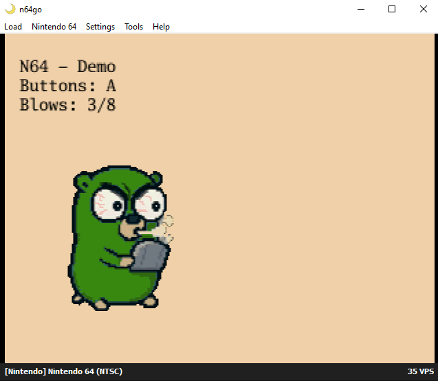

# n64-go-demo
* Building your own N64 ROM with embedded go 
* Entry point: https://www.timurcelik.de/posts/n64go-1-getting-started/ 

 
*Ares Emulator: tutorial result*

## Documentation

* [development.md](./docs/development.md): information about the development setup

----

### TODOs

* setup debug env
* handle TODOs created during tutorial
* check https://pkg.go.dev/github.com/clktmr/n64 for possibilities
* read out and display all controller codes, e.g. like Turicon 64 motion controls (fishing rod)
* show metadata of different controller types
* interact with rumble pak (e.g. reload weapon by inserting rumble? => early goldeneye/perfect dark idea)
* check persistence handling (fRAM, sRAM, eePROMm, controller pak)
* video player
* music player
* port libdragon example projects to go
* create go archetype for skeleton generation
* create tool ROM
* create game collection
* adapt libdragon framework to go
* find entry into 3D game development with go
* measure performance
* implementing unit tests
* github workflows for build checks
* ...
* research fo rother go lang N64 projects